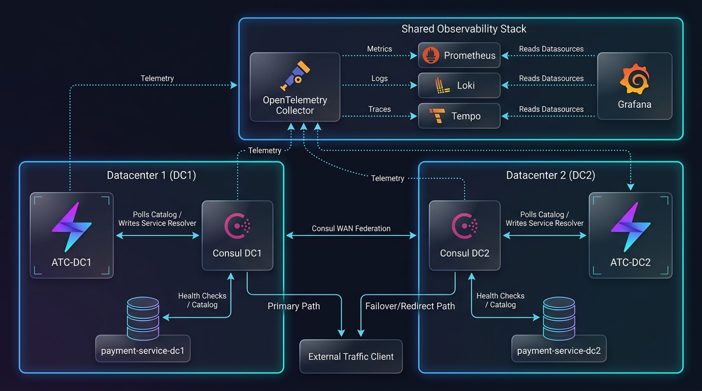

# ATC (Active Traffic Control) Docker Demo

This project provides a self-contained, Docker-based demo environment to showcase **ATC**'s dynamic Consul traffic control, failover, and redirect orchestration capabilities.

## Architecture Overview

The local demo environment is designed to closely mirror a production multi-datacenter deployment, featuring federated Consul clusters, independent traffic control daemons, mock backends, and a centralized observability stack:



### Core Components

1. **Consul Federation**:
   * **`consul-dc1`**: The primary Consul agent representing datacenter `dc1` (accessible at port `8500`).
   * **`consul-dc2`**: The secondary Consul agent representing datacenter `dc2` (accessible at port `8501`).
   * **WAN Federation**: The two Consul datacenters are connected via Consul's built-in WAN federation.

   > [!NOTE]
   > **Consul ACL Policy in the Demo**:
   > Consul ACLs are enabled in this environment to support token delegation. However, to keep the developer experience frictionless, the agents are started with a `default_policy = "allow"`. This allows anonymous reads/writes for other scenarios (like service registration) without requiring tokens. In a production environment, you should always enforce `default_policy = "deny"` to secure the cluster.
2. **Mock Backend Services**:
   * **`payment-service-dc1`**: A mock HTTP echo container representing the active service instance in `dc1` (listening on port `8080`).
   * **`payment-service-dc2`**: A mock HTTP echo container representing the standby service instance in `dc2` (listening on port `8082`).
3. **Active Traffic Controllers**:
   * **`atc-dc1`**: The primary Active Traffic Control daemon in `dc1` (accessible at UI port `8088`, telemetry port `8089`, and MCP port `8092`) watching the catalog status of `consul-dc1`.
   * **`atc-dc1-backup`**: The standby Active Traffic Control daemon in `dc1` (accessible at UI port `8094`, telemetry port `8095`, and MCP port `8096`) competing for the leader lock in `dc1`.
   * **`atc-dc2`**: The primary Active Traffic Control daemon in `dc2` (accessible at UI port `8090`, telemetry port `8091`, and MCP port `8093`) watching the catalog status of `consul-dc2`.
4. **Shared Observability Stack**:
   * **OpenTelemetry Collector**: Receives gRPC (port `4317`) and HTTP (port `4318`) trace, metrics, and log signals emitted by the ATC daemons and Consul agents.
   * **Prometheus**: Scrapes application metrics and stores them for visualization (accessible at port `9090`).
   * **Loki**: Captures structured JSON log streams and override audit logs from the containers (accessible at port `3100`).
   * **Tempo**: Stores and visualizes distributed tracing spans to capture request latency patterns (accessible at port `3200`).
   * **Grafana**: Pre-configured with datasources and a comprehensive ATC dashboard (accessible at port `3000`) showing reconciliation loop latencies, status counts, and service traffic routes.

> [!TIP]
> **Production Deployments**:
> While this demo is Docker Compose-based, production-ready configurations for Kubernetes (Helm) and Nomad are available in the main repository's [deploy](file:///Users/attachmentgenie/DevShed/Projects/atcprojectio/atc/deploy) directory.

## Test Scenarios Overview

To comprehensively validate ATC's capabilities, this demo project includes several test scenarios designed to simulate real-world failure patterns and operational requirements:

1. **[Automated Failover & Redirect](docs/automated_failover_redirect.md)**:
   * **Why**: Validates that ATC automatically publishes Consul `service-resolver` failover configuration when a local service is healthy, and seamlessly updates it to a hard redirect rule when the local service goes offline.
2. **[Testing Gray Failures (Latency Simulation)](docs/gray_failures.md)**:
   * **Why**: Simulates degraded performance (latency) where health checks remain green but client requests suffer. It validates the capability to apply manual failover/redirect overrides via REST API or MCP to bypass automated loops.
3. **[Hysteresis (Oscillation Dampening)](docs/hysteresis.md)**:
   * **Why**: Simulates flapping health status. It validates ATC's oscillation dampening algorithm, ensuring Consul configurations are protected from excessive write churn when a backend flips rapidly.
4. **[Active-Passive HA & Datacenter Isolation](docs/ha_datacenter_isolation.md)**:
   * **Why**: Validates how separate ATC instances use Consul KV Session locks to run active-passive coordinator loops independently within their respective datacenters.
5. **[Testing Manual Overrides](docs/manual_overrides.md)**:
   * **Why**: Verifies the administrative manual overrides mechanism and confirms that the automated watcher loops temporarily yield reconciliation control for services with active overrides.
6. **[Dynamic Configuration Hot-Reload](docs/hot_reload.md)**:
   * **Why**: Demonstrates ATC's ability to watch its configuration file and dynamically reload routing strategies and dampening thresholds at runtime without process restarts.
7. **[Local HA & Leader Failover Simulation](docs/ha_leader_failover.md)**:
   * **Why**: Validates local active-passive coordinator failover within a single datacenter using Consul KV session locks.
8. **[Security & Token Delegation](docs/security_tokens.md)**:
   * **Why**: Shows how to secure ATC REST and MCP endpoints and authenticate clients using static keys or delegated Consul ACL tokens.
9. **[Telemetry & Observability (Prometheus/Grafana)](docs/telemetry_metrics.md)**:
   * **Why**: Shows how to inspect ATC health checks, query metrics in Prometheus, and use the pre-configured Grafana dashboards to monitor live routing states, logs, and traces.

---

## Quick Start

### 1. Pull the Docker Images
First, pull the latest released ATC and Consul docker images:
```bash
make pull
```

### 2. Start the Stack
Spin up the two Consul nodes and the ATC service:
```bash
make up
```

### 3. Run the Automated Demo
Execute the interactive CLI demo script to see ATC failover/redirection in action:
```bash
make run-demo
```

---

## Web UI & Observability Dashboards

You can inspect the live state, tracked services, and failover status using the UI dashboards:
- **ATC Web UI**: [http://localhost:8088](http://localhost:8088) (glassmorphic React dashboard)
- **Consul DC1 UI**: [http://localhost:8500](http://localhost:8500)
- **Consul DC2 UI**: [http://localhost:8501](http://localhost:8501)
- **Grafana**: [http://localhost:3000](http://localhost:3000) (pre-configured dashboard visualizing reconciliation rates, loop execution times, Consul latency, and Loki override logs)

---

## Available Make Tasks

| Command | Description |
|---|---|
| `make pull` | Pulls the latest released ATC and Consul docker images |
| `make build` | Alias for `make pull` |
| `make up` | Starts the Docker containers in the background and federates datacenters |
| `make down` | Stops the containers and the observability stack |
| `make up-infra` | Starts Consul agents and mock services only (no ATC) |
| `make down-infra` | Stops and removes Consul agents and mock services |
| `make up-atc` | Starts the ATC controller container instances |
| `make down-atc` | Stops and removes the ATC controller container instances |
| `make up-obs` | Starts the LGTM observability stack (Grafana, Prometheus, Loki, Tempo) |
| `make down-obs` | Stops the LGTM observability stack |
| `make clean` | Shuts down containers, tears down observability stack, and removes all volumes |
| `make join-wan` | Manually establishes Consul WAN federation |
| `make register` | Registers a test instance of `payment-service` in `dc1` |
| `make register-dc2` | Registers a test instance of `payment-service` in `dc2` |
| `make deregister` | Deregisters `payment-service` from `dc1` |
| `make client` | Runs the traffic routing client |
| `make client-laggy` | Runs the traffic client with 800ms mock latency on DC1 requests (simulates gray failure) |
| `make override-failover` | Applies a manual failover override targeting `dc2` |
| `make override-redirect` | Applies a manual redirect override targeting `dc2` |
| `make purge` | Permanently purges the `payment-service` resolver from ATC |
| `make test-hysteresis` | Runs the automated flapping hysteresis test script |
| `make status-atc` | Outputs active modules and service tables from ATC CLI |
| `make status-consul` | Queries Consul for the current state of the resolver config entry |
| `make status-federation` | Queries the ATC WAN federation status |
| `make status-leader` | Queries leadership status of the primary ATC node (`atc-dc1`) |
| `make status-leader-backup` | Queries leadership status of the standby ATC node (`atc-dc1-backup`) |
| `make status-leader-static` | Verifies leader query using static key authorization header |
| `make status-leader-consul` | Verifies leader query using delegated Consul ACL token |
| `make status-leader-invalid` | Verifies leader query using an invalid/unknown auth token |
| `make status-metrics` | Queries exposed Prometheus metrics for ATC |
| `make stop-primary` | Stops the active primary container `atc-dc1` to trigger failover |
| `make start-primary` | Starts the primary container `atc-dc1` back online |
| `make logs-atc` | Prints logs of the primary `atc-dc1` container |
| `make logs-backup` | Prints logs of the standby `atc-dc1-backup` container |
| `make run-demo` | Executes the interactive CLI walkthrough |

